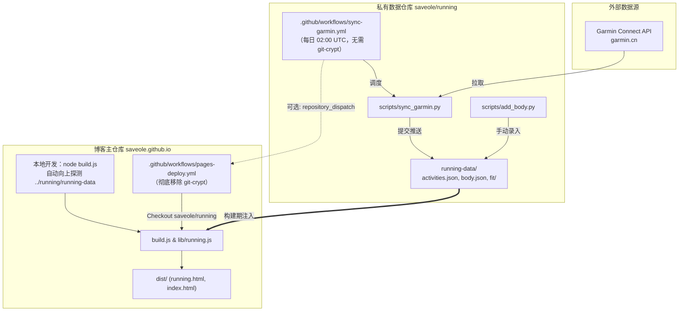

# 跑步与身体数据模块迁移方案 (Migration Plan - Updated)

> **最新进度更新（2026-09-16）**：
> 已将跑步和身体数据及相关脚本复制至 `~/blog/running`（即 `/home/ant/blog/running`）。
> 博客本地已形成与 `token-usage` 对齐的同级多仓库架构。

---

## 1. 现状与目标目录结构

### 1.1 磁盘布局现状
当前本地 `~/blog` 目录结构如下：
```text
~/blog/
├── saveole.github.io/          # 博客主仓库（静态站点构建）
├── token-usage/                # Token 消耗数据私有仓库
└── running/                    # 新建的跑步与身体数据仓库（本地已建立）
    ├── README.md               # 待精简的说明文档
    ├── running-data/           # 核心数据
    │   ├── activities.json     # 跑步聚合数据
    │   ├── body.json           # 体重/体脂数据
    │   ├── fit/*.fit           # 原始 FIT 轨迹文件
    │   └── MIGRATION_PLAN.md   # 本迁移计划文档
    └── scripts/                # 维护脚本
        ├── add_body.py         # 体测数据录入 CLI
        └── sync_garmin.py      # Garmin 同步脚本
```

### 1.2 脚本路径兼容性审计
经审计，`sync_garmin.py` 和 `add_body.py` 的定位逻辑均为：
```python
SCRIPT_DIR = os.path.dirname(os.path.abspath(__file__))
REPO_DIR = os.path.dirname(SCRIPT_DIR)
OUTPUT_FILE = os.path.join(REPO_DIR, "running-data", "activities.json") # 或 body.json
```
由于在 `~/blog/running` 下保留了 `running-data/` 子目录，**现有 Python 脚本在新仓库中可以直接运行，无需修改路径代码**。

---

## 2. 核心架构与跨仓库协同



### 2.1 本地开发体验（零配置自动探测）
为了让本地开发最舒心，无需强制设置环境变量，`saveole.github.io/build.js` 可采用智能路径解析：
```javascript
const RUNNING_DATA_DIR = process.env.RUNNING_DATA_DIR || 
  (fs.existsSync(path.join(__dirname, 'running-data', 'activities.json'))
    ? path.join(__dirname, 'running-data')
    : path.join(__dirname, '..', 'running', 'running-data'));
```
**优势**：
- 在本地开发时，直接运行 `node build.js` 就能自动找到 `../running/running-data`。
- CI 构建时，既可 checkout 到 `./running-data`，也可通过 `RUNNING_DATA_DIR` 指定。
- 若没有数据，`lib/running.js` 自动容错，不中断页面构建。

### 2.2 彻底告别 `git-crypt`
- `saveole/running` 本身作为 **GitHub Private 仓库**，由 GitHub 账户权限提供原生安全保障。
- **因此迁移后在新仓库中完全无需使用 `git-crypt`**。
- 同步工作流 `sync-garmin.yml` 不再需要 `sudo apt-get install -y git-crypt` 和密钥解锁步骤，执行耗时更短、故障率更低。
- 博客主仓库的 `pages-deploy.yml` 同样彻底移除 `git-crypt`。

---

## 3. 详细调整方案与实施清单

### 步骤一：完善并初始化 `~/blog/running` 仓库

1. **迁移工作流**：
   - 将主仓库的 `.github/workflows/sync-garmin.yml` 复制到 `~/blog/running/.github/workflows/sync-garmin.yml`。
   - **修改工作流**：删除其中安装和解锁 `git-crypt` 的两个 steps。
   - （可选）：在 commit & push 成功后，增加触发博客仓库重构的步骤（调用 `repository_dispatch`）。
2. **新增环境与依赖配置**：
   - 创建 `requirements.txt`：
     ```text
     garth>=0.5.0
     fitparse>=1.2.0
     ```
   - 创建 `.gitignore`：
     ```text
     __pycache__/
     *.pyc
     .DS_Store
     .env
     *.log
     ```
3. **精简 `README.md`**：
   - 移除阅读脚本（`add_book.py`、`add_quote.py`）等不相关说明，聚焦于：
     - `scripts/sync_garmin.py` 的使用与参数；
     - `scripts/add_body.py` 的使用；
     - 定时工作流与 GitHub Secrets（`GARMIN_SECRET`）配置。
4. **Git 初始化与远程关联**：
   - 进入 `~/blog/running` 执行 `git init`，提交所有文件。
   - 在 GitHub 创建私有仓库 `saveole/running`（或根据偏好命名）。
   - 关联并推送远程：`git remote add origin git@github.com:saveole/running.git` 并 `git push -u origin main`。
   - 在新仓库的 Settings -> Secrets and variables -> Actions 中配置 `GARMIN_SECRET`。

---

### 步骤二：博客主仓库改造 (`saveole.github.io`)

1. **构建脚本与容错适配**：
   - [`build.js`](file:///home/ant/blog/saveole.github.io/build.js)：
     - 将 `RUNNING_DATA_DIR` 改为优先读环境变量，兜底读取当前目录或 `../running/running-data`。
   - [`lib/running.js`](file:///home/ant/blog/saveole.github.io/lib/running.js)：
     - 增加路径鲁棒性：支持直接传入包含 `activities.json` 的目录，或其上一级目录。
     - 增加容错：若目录不存在或数据文件缺失，`loadRunningMap` 返回 `{}`，`buildRunningPageData` 返回 `null`，不 crash 构建流程。
   - [`test/pipelines.test.js`](file:///home/ant/blog/saveole.github.io/test/pipelines.test.js)：
     - 适配新路径逻辑，确保在缺失外部数据时测试依然通过。
2. **部署工作流优化 (`.github/workflows/pages-deploy.yml`)**：
   - **移除** `git-crypt` 的安装和 `Unlock encrypted data` 步骤。
   - **新增**检出跑步数据的步骤（对齐 `token-usage`）：
     ```yaml
     - name: Checkout running data
       uses: actions/checkout@v4
       with:
         repository: saveole/running
         path: running-data
         token: ${{ secrets.RUNNING_DATA_READ_TOKEN }} # 或共用只读 PAT
     ```
   - （可选）在 `on` 中添加 `repository_dispatch: [running_data_updated]`。
3. **主仓库 Secrets 调整**：
   - 在 `saveole.github.io` 仓库 Settings -> Secrets 中添加 `RUNNING_DATA_READ_TOKEN`（具备读取 `saveole/running` 权限的 PAT，如果现有的 `TOKEN_USAGE_READ_TOKEN` 拥有账户下所有私有仓库读取权限，亦可复用）。
   - 确认无误后可废弃 `GIT_CRYPT_KEY`。

---

### 步骤三：主仓库清理与归档

1. **清理主仓库内的跑步数据与脚本**：
   - 从 Git 中取消对 `running-data/` 的跟踪：
     `git rm -r --cached running-data`
   - 将 `running-data/` 加入博客主仓库的 `.gitignore`。
   - 移除主仓库中的 `scripts/sync_garmin.py`、`scripts/add_body.py`。
   - 移除主仓库中的 `.github/workflows/sync-garmin.yml`。
   - 移除 `.gitattributes` 中的 `git-crypt` 过滤规则（由于只有 running-data 使用它，移除后可保留空文件或直接删除 `.gitattributes`）。
2. **更新文档**：
   - 更新 `CLAUDE.md`：在 "Architecture" 和 "Build Process" 章节补充 `running` 数据的外部消费方式（对齐 `token-usage` 章节）。
   - 更新 `README.md` 与 `scripts/README.md`。

---

## 4. 实施校验点（Checklist）

- [ ] **验证 1（新仓库）**：在 `~/blog/running` 运行 `python scripts/add_body.py 70 18` 确认记录写入成功。
- [ ] **验证 2（新仓库）**：新仓库的 GitHub Actions 成功触发一次 `sync_garmin.py` 并正常完成 commit。
- [ ] **验证 3（本地博客）**：在 `~/blog/saveole.github.io` 运行 `node build.js`，确认自动识别到 `../running/running-data`，且生成的 `dist/running.html` 包含最新数据。
- [ ] **验证 4（容错测试）**：临时重命名 `../running` 或指定空目录，运行 `node build.js`，确认博客其余页面正常构建无报错。
- [ ] **验证 5（CI 远端）**：推送博客主仓库至 GitHub，观察 `pages-deploy.yml` 构建日志，确认无需 `git-crypt`，且拉取 `saveole/running` 成功编译上线。
