# 跑步轨迹数据获取与生成流程

本文档描述从 Garmin Connect 获取跑步活动数据、解析 GPS 轨迹、编码存储、前端 SVG 可视化，以及轨迹相似度计算的完整流程。

---

## 整体架构概览

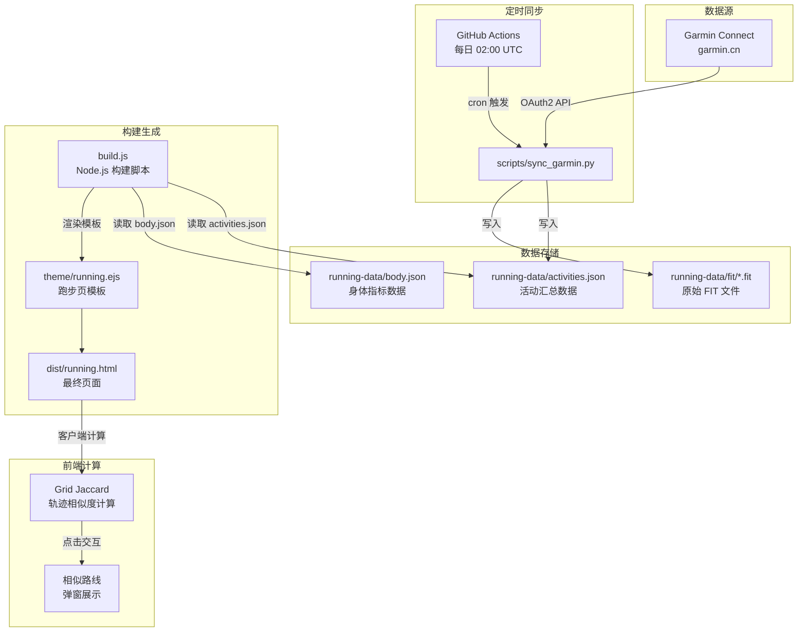

---

## 阶段一：定时同步（GitHub Actions）

同步由 GitHub Actions 工作流 `.github/workflows/sync-garmin.yml` 触发。

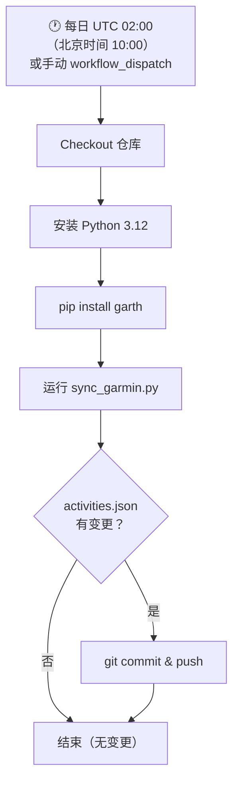

**关键配置：**
- 认证凭据 `GARMIN_SECRET` 存储在 GitHub Secrets 中
- 使用 `garth` 库管理 OAuth2 令牌（自动刷新）
- 仅提交 `running-data/activities.json` 的变更

---

## 阶段二：数据获取与处理（sync_garmin.py）

这是核心的 Python 脚本，负责从 Garmin Connect API 获取跑步数据并提取 GPS 轨迹。

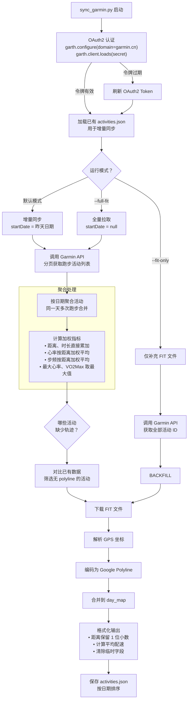

### Garmin API 调用细节

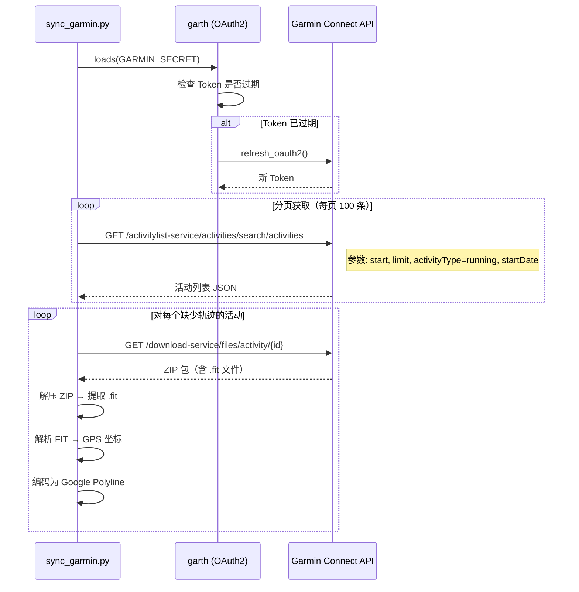

---

## 阶段三：GPS 坐标解析与 Polyline 编码

### FIT 文件解析

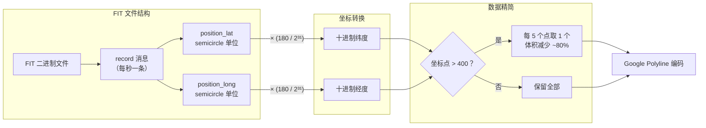

### Google Encoded Polyline 算法

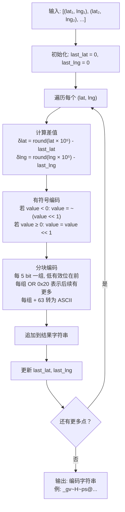

**编码示例：**

| 步骤 | 值 | 说明 |
|------|------|------|
| 原始纬度 | `39.9042` | 北京天安门附近 |
| × 10⁵ 取整 | `3990420` | 转为整数 |
| 首点 δ | `3990420` | 第一个点无差值 |
| 左移 1 位 | `7980840` | `value << 1` |
| 分块 | `0x14 0x6E 0x79 0x00` | 每 5 bit 一组 |
| +63 转 ASCII | `"..."` | 最终编码字符 |

---

## 阶段四：数据存储格式

### activities.json 结构

```json
[
  {
    "date": "2026-05-25",
    "start_time": "07:15:32",
    "type": "running",
    "distance_km": 8.5,
    "duration_s": 2550,
    "avg_pace_s_per_km": 300,
    "avg_hr": 155,
    "max_hr": 172,
    "cadence_spm": 178.5,
    "vo2max": 48.2,
    "summary_polyline": "_gv~H~ps@..."
  }
]
```

| 字段 | 类型 | 说明 |
|------|------|------|
| `date` | string | 活动日期 YYYY-MM-DD |
| `start_time` | string | 开始时间 HH:MM:SS |
| `type` | string | `running`（户外）或 `treadmill_running`（跑步机） |
| `distance_km` | float | 距离（公里），同日多次跑步累加 |
| `duration_s` | int | 时长（秒），同日累加 |
| `avg_pace_s_per_km` | int | 平均配速（秒/公里） |
| `avg_hr` | int | 平均心率，按距离加权 |
| `max_hr` | int | 最大心率，取当日最大 |
| `cadence_spm` | float | 平均步频（步/分钟），按距离加权 |
| `vo2max` | float | 最大摄氧量，取当日最大 |
| `summary_polyline` | string | GPS 轨迹的 Google Polyline 编码 |

---

## 阶段五：构建处理（build.js）

构建脚本读取 JSON 数据，格式化后注入 EJS 模板。

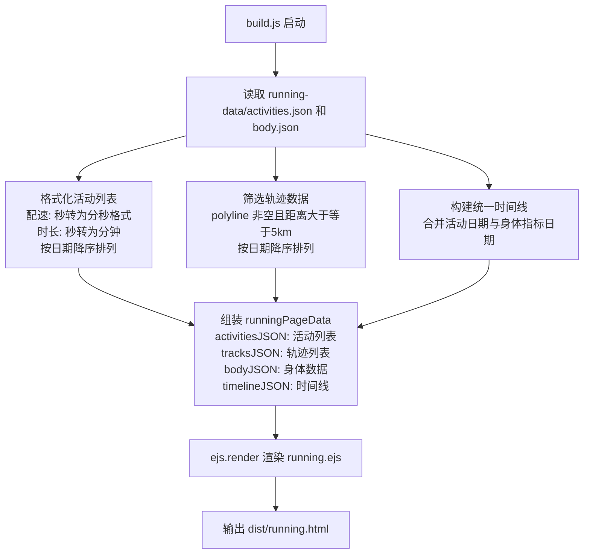

**轨迹筛选条件：**
1. `summary_polyline` 不为空（有 GPS 数据的户外跑）
2. `distance_km >= 5`（至少 5 公里）
3. 前端最多显示 **9 条**最近轨迹

---

## 阶段六：前端可视化与相似度（running.ejs）

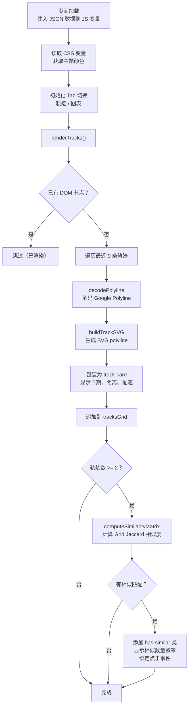

### Polyline 解码过程

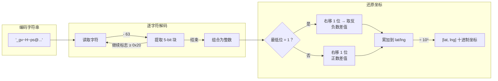

### SVG 轨迹渲染原理

```
┌─────────────────────────────┐
│  SVG viewBox="0 0 200 200"  │
│                             │
│   pad=5                     │
│   ┌───────────────────┐     │
│   │    ╭───╮          │     │
│   │   ╱    ╲    ╭─╮   │     │
│   │  ╱      ╲──╯  ╲  │     │
│   │ ╱              ╲ │     │
│   │╱                 ╰╯     │
│   └───────────────────┘     │
│                             │
│  2026-05-25                 │
│  8.5 km · 5'00"            │
└─────────────────────────────┘
```

- 所有坐标归一化到 `[5, 195]` 范围（留 5px 内边距）
- Y 轴翻转（纬度越大越靠上）
- 使用 SVG `<polyline>` 绘制连续路径
- 无需外部地图库，纯 SVG 渲染

---

## 阶段七：轨迹相似度计算（Grid Jaccard）

### 为什么需要相似度

跑者经常重复跑同一条路线。相似度计算帮助识别「哪些日子跑了相同的路线」，发现训练规律。

### 方案选型

| 方案 | 复杂度 | 准确性 | 抗速度差异 | 选择 |
|------|--------|--------|-----------|------|
| Fréchet Distance | 高（DP 矩阵） | 优秀 | 好 | 过重 |
| DTW | 高（DP 矩阵） | 好 | 优秀 | 不必要 |
| Hausdorff Distance | 中 | 差 | — | 小分支误判 |
| **Grid Jaccard** | **低（~30 行）** | **好** | **天然支持** | **✅ 采用** |
| Bounding Box | 极低 | 差 | — | 过于粗糙 |
| Route Hashing | 中 | 仅精确匹配 | 差 | 过于严格 |

### 算法原理

将 GPS 坐标离散化为网格单元，比较两条轨迹覆盖的网格重叠度（Jaccard 系数 = 交集 / 并集）。

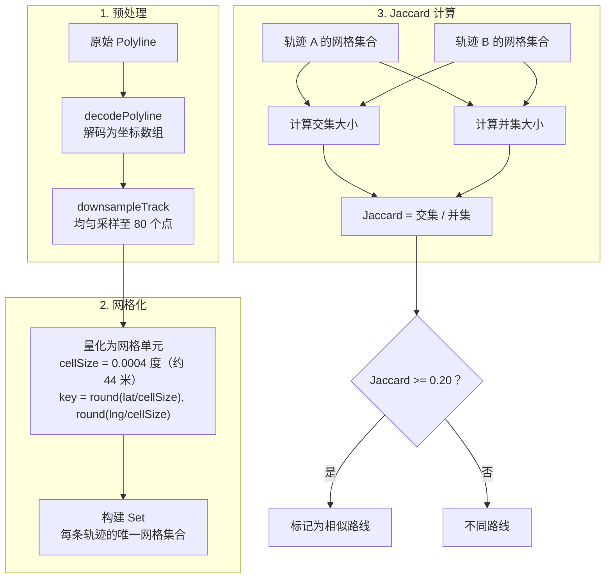

### 参数说明

| 参数 | 值 | 说明 |
|------|------|------|
| `cellSize` | `0.0004` 度 | 约 44 米，覆盖半个街区，允许小偏差 |
| `sampleCount` | `80` 个点 | 统一采样密度，消除速度差异影响 |
| `threshold` | `0.20` | Jaccard >= 20% 视为相似路线 |

### 算法优势

- **天然抗速度差异**：比较空间覆盖，不比较点顺序，快跑慢跑同一路线结果一致
- **容错性好**：44 米网格单元意味着偏离一两个路口仍能匹配
- **部分匹配**：5km 短路线与 10km 长路线共享路段时，Jaccard 反映重叠比例
- **纯前端计算**：无需后端，9 条轨迹 36 对比较 < 5ms

### 相似路线交互流程

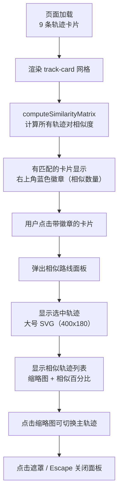

### UI 元素

| 元素 | 样式 | 作用 |
|------|------|------|
| `.track-similar-badge` | 右上角蓝色圆角标签 | 显示相似路线数量 |
| `.track-card.has-similar` | 鼠标指针变手型，悬停蓝色边框 | 提示可点击查看相似路线 |
| `.similar-overlay` | 全屏半透明遮罩 | 弹窗背景 |
| `.similar-panel` | 居中白色面板 | 包含主轨迹 + 相似列表 |
| `.similar-track-thumb` | 水平滚动缩略图 | 每个显示日期 + 相似百分比 |

---

## 完整数据流总结

```mermaid
flowchart LR
    subgraph "1️⃣ Garmin Connect"
        A["跑步活动<br/>GPS + 传感器数据"]
    end

    subgraph "2️⃣ Python 同步"
        B["OAuth2 认证"]
        C["API 获取活动列表"]
        D["下载 FIT 原始文件"]
        E["解析 GPS → Polyline"]
        F["聚合 + 保存 JSON"]
    end

    subgraph "3️⃣ Node.js 构建"
        G["读取 JSON"]
        H["格式化 + 筛选"]
        I["注入 EJS 模板"]
    end

    subgraph "4️⃣ 前端渲染"
        J["解码 Polyline"]
        K["坐标归一化"]
        L["SVG 渲染轨迹"]
    end

    subgraph "5️⃣ 相似度计算"
        M["Grid Jaccard 算法"]
        N["标记相似路线"]
        O["弹窗交互展示"]
    end

    A --> B --> C --> D --> E --> F --> G --> H --> I --> J --> K --> L --> M --> N --> O
```

---

## 关键技术决策

| 决策 | 选择 | 原因 |
|------|------|------|
| GPS 编码格式 | Google Encoded Polyline | 紧凑（比 JSON 坐标数组小 ~80%），前端解码简单 |
| 轨迹渲染方式 | SVG polyline | 无需地图 SDK，轻量级，适合展示路线轮廓 |
| 坐标精简策略 | >400 点时每 5 取 1 | Garmin 每秒记录，1 小时 3600 点；精简后视觉无损 |
| 同步策略 | 增量（默认）+ 全量（`--full-fit`） | 日常增量快速；全量用于补充缺失轨迹 |
| 同日多次跑步 | 距离/时长累加，心率加权 | 避免同日多条记录，保持日期维度唯一 |
| 户外 vs 跑步机 | 有 polyline 为户外，无则为跑步机 | 跑步机无 GPS，polyline 为空自然区分 |
| 相似度算法 | Grid Jaccard | 实现简单（~30 行），天然抗速度差异，前端计算 < 5ms |
| 网格单元大小 | 0.0004 度（约 44 米） | 覆盖半个街区，允许路线小幅偏差仍能匹配 |
| 相似度阈值 | 0.20（20%） | 区分同小区不同路线与真正重复路线 |
| 相似度计算时机 | 前端页面加载后 | 静态站点无后端，纯客户端计算 |
