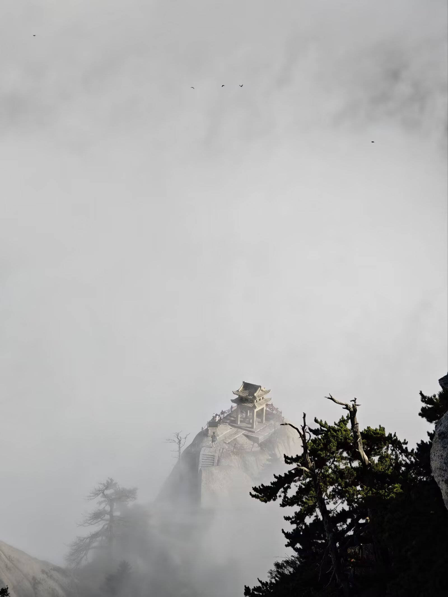

## 生活

今年的 5 月 10 号上午，我当上了爸爸，小宝可爱极了，成为爸爸的感觉是很奇妙的，从此又多了个牵挂的人。我给他喂了第一口奶粉，给他换了第一个纸尿裤，看着他长了第一颗牙，听了他喊妈妈，看着他第一次感冒，喉咙沙哑，住院输液。生命是如此美好，希望我以后能作为爸爸和朋友，常伴孩子边，和他一起享受成长的酸甜苦辣。

新房今年交付，5 月份开始了装修。我们选择的是半包，480/平 的价格，包括了水电，木工，砖工和部分材料的钱。房子的主要设计和沟通工作主要是岳父完成的。非常感谢他，装修的细节太多了，如果没有专门监理类的角色在，装修师傅们是很容易在你看不到的地方糊弄过去的。可能和现在的 Vibe Coding 中的 Agent 比较像，他们总是想以最省的方式完成需求。房子在 10 月份基本完成了硬装，沙发/床/餐桌椅等大件家具已经配置了，由于不着急入住，家电之类的还没明年再看看。国内的消费环境可能还是一时半会好不起来，看看明年会不会有更大力度的消费刺激政策。

运动健康方面，自从孩子在 10 月份感冒后，深感自己也得减减肥/运运动来增强抵抗力了，免得自己得了流感传染孩子。11 月办了乐刻的会员，开始跑步。一个半月的时间，[跑了 169 km](https://saveole.github.io/running_page/)，体重掉了 5.7 kg，体脂率从 28.7% 来到了 20.2%。当然也不仅是跑步，还配合了每周一次两个小时的五人制足球，饮食方面也几乎没有吃米/面等传统碳水，改为芋艿/红薯/玉米/香蕉+鸡蛋/鱼类/牛排/鸡胸肉+水果/坚果+大量蔬菜混煮的结构，脂肪的确下降得比较快。但运动得太狠，受伤的风险也增加了。最近踢球崴了脚，得休息至少两周，感觉饮食习惯又开始要反弹了。后面也要专门看看运动康复方面的资料，同时也要加强下力量训练。

11 月接种了四价流感疫苗，到了后面流感流行的时候，自己感觉要感冒，出现了喉咙发痒，轻微咳嗽的症状，但过了一两天就不再加重了，看来这个疫苗还是有点效果的。按往年这样的时候是绝不敢回家了，怕传染孩子。

还有就是今年还是异地的一年。从 2019 年恋爱，到 2023 年结婚，再到 2025 年有了孩子，我还是在异地，异地了快 6 年。希望明年能结束异地的状态吧！

## 工作

今年公司的业务不太好了，活也不是很多，而且关于组织架构调整的动作不断出现，而且部门内也都是不好的消息。自己今年的主观能动性明显不足，甚至希望借着调整能回到家人身边或更近的地方。

年初设定的参与开源的目标几乎无进展和落地，真去想参与开源的时候发现不好下手，特别是上半年领了 AutoMQ 的 issue 但后面放弃了，明年再参与好了，今年得到的教训是：1. 在开源上要放弃 Java 生态 2. 找自己平时经常使用的/活跃的开源项目 3. 在 AI 编码时代下找到战胜技术虚无主义的思想。

## AI

今年下半年高频使用了 Claude Code + GLM 套餐的组合来进行编码。之所以使用智谱的代餐，主要是觉得大模型的能力会通过迭代快速追平(其实就是 qiong)的,GLM 的套餐在我目前的工作场景中已经够用了，我当前更注重更好的需求描述和 openspec/cc command or skill 以及项目/个人代码偏好规约等将 AI Agent 和我本身的工作需求做适配，成为大幅提效的助手。

AI 是极大提升了特定领域的生产效率的，生产力的大幅提升，必然会促进组织结构的变革更新，今后的软件工程，公司组织架构肯定会发生比较大的变化，这方面可能会出现比较多的新形态，明年可能就是这样的一年。

## 其他

西安之行：9 月份 Q3 的团建目的地是西安，我们提前一天到达。西安的碳水还是很顶的，但作为南方人，对面食不是非常喜欢(小时候被村里大叔自制的低质挂面弄坏了对面食的感受)。惊喜的是和同事一起去爬了华山，虽然只有半天，但依然被雨后华山惊艳到了，明白了山水画的写实意义。而且还碰到了云海中的七彩佛晕，更绝的是，我拍到了自己的倒影在佛晕中心挥手的视频和照片，虽然手机变焦拍出来不是很清晰，但这也是一辈子可能只会发生一次的事情了，可遇不可求。

💩 拉裤裆：今年最糗的一件事，出了地铁回家的几分钟忍不住了，在楼下几百米的地方释放了压力，场面很糟糕，弄得卫生间气味很大。我想这是身体的一个信号，在最后一次还是学前班干的事这次在二十多年后又干了，伴随着这两年体重逐渐超标，憋 💩 的能力也不如前，身体这是告诉我现在亚健康了，坐的多运动少。我想这件事足够让我警觉，运动将成为我长期主义的首项事业。

## 结语

2025 年快过完了，这一年是我人生中重要的一年，今后的每一年也将会同样重要，希望我们都能健康快乐！
